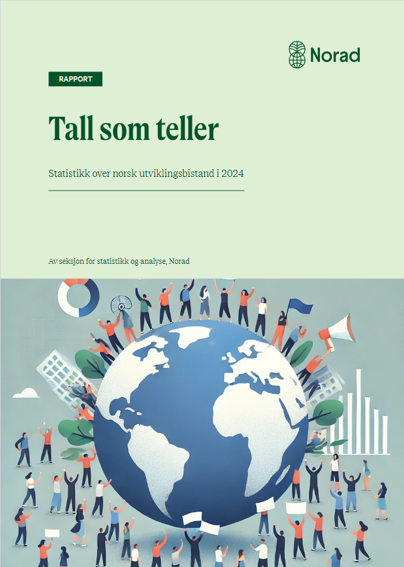

# Norad Report Template for generating PDFs using Typst in Quarto
A customized tempate to create Norad PDF reports using Typst in Quarto. The design is a Typst implementation of the Norad Rapportmal for Microsoft Word using Norads fonts, color palette and other design guidelines from Norad's Design Manual.

## Installing

```bash
quarto use template noradno/norad-report-typst-template
```
This will install the format extension and create an example qmd file that you can use as a starting place for your Norad report.

## Using
The example qmd demonstrates the document options supported by the Norad Report Format (`title`, `subtitle`, `author`, `date-published`, `date-updated`, `isbn`, `cover-image`, `lang`, `toc`, etc.). For example, your document options might look something like this:

```yaml
title: "Tall som teller"
subtitle: "Statistikk over norsk utviklingsbistand i 2024"
documentlabel: "RAPPORT"
author: "Av seksjon for statistikk og analyse, Norad"
cover-image: "cover-image-regimetype.png"
cover-image-credit: "Foto: Generert av ChatGPT"
date: last-modified
date-format: long
date-published: "Dato publisert: 13.05.2025"
date-updated:
isbn: "ISBN: XXX XX XXX"
lang: nb
region: NO
execute:
  freeze: false
  merge: true  # Ensures figures, tables, and references work across child documents
  echo: false
  message: false
  warning: false
format:
  norad-report-template-typst:
    toc: true
    toc-title: "Innhold"
    toc-depth: 3
    number-sections: false
    tof: true
    tof-title: "Figurer"
    # section-numbering: "1.1.1"
---
```

The title page of this document would be rendered as:



